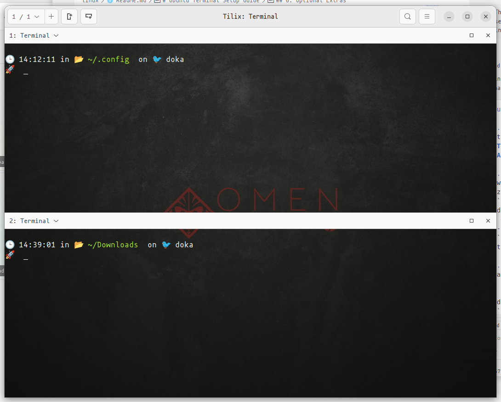

# Ubuntu Terminal Setup Guide

## 1. Install a Terminal Emulator
Ubuntu comes with **GNOME Terminal** by default, but you can try alternatives:
- **Tilix**: `sudo apt install tilix`
- **Alacritty**: [Install instructions](https://github.com/alacritty/alacritty)

## 2. Install a Nerd Font
- Download from [Nerd Fonts](https://www.nerdfonts.com/font-downloads)
- Unzip and move to fonts directory:
  ```bash
  mkdir -p ~/.local/share/fonts
  mv <downloaded-fonts> ~/.local/share/fonts/
  fc-cache -fv
  ```
- Set the font in your terminal’s preferences.

## 3. Install Starship Prompt
```bash
curl -fsSL https://starship.rs/install.sh | bash
```
- Add to your shell config (`~/.bashrc`, `~/.zshrc`, etc.):
  ```bash
  eval "$(starship init bash)"
  ```
  or for zsh:
  ```bash
  eval "$(starship init zsh)"
  ```

# Configuring Starship
- Create a config file at `~/.config/starship.toml`
- Y


## 4. Syntax Highlighting & File Previews
- **bat** (cat alternative):
  ```bash
  sudo apt install bat
  ```
  (On Ubuntu, the binary is called `batcat`)
- **LS_COLORS**: Use [dircolors-solarized](https://github.com/seebi/dircolors-solarized)
- Colored grep:
  ```bash
  alias grep='grep --color=auto'
  ```

## 5. Theme & Color Scheme
- Change your terminal color scheme in preferences.
- Popular themes: **Dracula**, **Solarized Dark**, **One Half Dark**
- For GNOME Terminal: Use [gnome-terminal-colors-dracula](https://github.com/dracula/gnome-terminal)

## 6. Optional Extras
- **Oh My Posh** (works on Linux too):
  ```bash
  curl -s https://ohmyposh.dev/install.sh | bash
  ```
  Add to your shell config:
  ```bash
  eval "$(oh-my-posh init bash --config ~/.poshthemes/<theme>.omp.json)"
  ```
- **fzf** (fuzzy finder): `sudo apt install fzf`
- **zoxide** (better cd): `curl -sS https://webinstall.dev/zoxide | bash`

---

**Sample Look:**  


---

Enjoy your modern Ubuntu terminal!