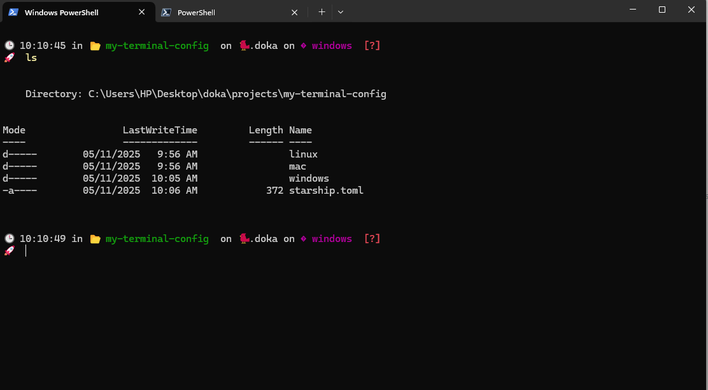
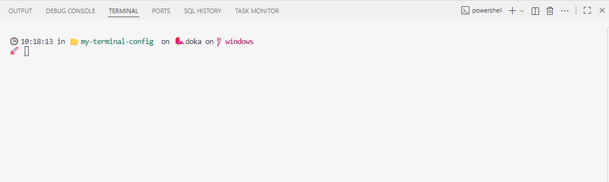

# Fonts
Get fonts from https://www.nerdfonts.com/


# HOW TO INSTALL
To install and confure a nice looking poweshell version 7, follow the following steps:

See Sample look below:


Sample Look on VS Code


---

### ✅ **1. Install Windows Terminal(Exists by default on windows)**
If you don’t already have it:
- Download from **Microsoft Store** or Windows Terminal GitHub.

---

### ✅ **2. Install a Shell (PowerShell or WSL)**
- **PowerShell 7+** (recommended).
- Or use **WSL (Linux)** if you prefer a Linux environment.

---

### ✅ **3. Install a Nerd Font**
Uses icons and symbols, which come from **Nerd Fonts**.
- Download from Nerd Fonts.
- Install and set it as your terminal font in **Settings → Appearance → Font**.

---

### ✅ **4. Customize the Prompt**
To use the **Starship Prompt**:
- Install Starship:
  ```bash
  # For PowerShell
  winget install Starship
  # For Linux
  curl -fsSL https://starship.rs/install.sh | bash
  ```
- Add to your shell config:
  - **PowerShell**: Add this to `$PROFILE`:
    ```powershell
    Invoke-Expression (&starship init powershell)
    ```
  - **Bash/Zsh**: Add to `~/.bashrc` or `~/.zshrc`:
    ```bash
    eval "$(starship init bash)"
    ```

---

### ✅ **5. Syntax Highlighting for Commands**
For colored output text install:
- **LS_COLORS** and **bat** for file previews.
- Install `bat` (a cat alternative with syntax highlighting):
  ```bash
  winget install bat
  ```
- Use `grep --color=auto` for colored matches.

---

### ✅ **6. Theme & Color Scheme**
- Go to **Windows Terminal Settings → Appearance → Color Scheme**.
- Choose a vibrant theme like **One Half Dark**, **Dracula**, or create your own.

---

### ✅ **7. Optional Extras**
- **Oh My Posh** (alternative to Starship for PowerShell):
  ```powershell
  winget install oh-my-posh
  ```
- Configure segments for Git, time, and context.

---